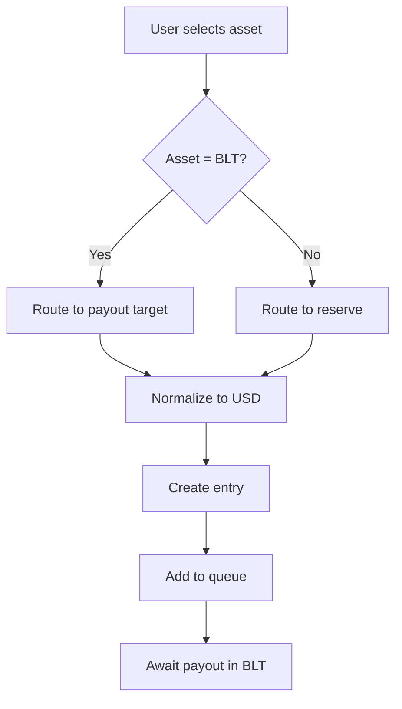

# Trenches Mechanics Specification

> **Status**: LAW (Updated 2026-01-14)
> 
> **Purpose**: Core economic rules, asset routing, and reserve mechanics

---

## 1. ROI Model (LOCKED)

**All trenches: 1.5× max return**

- No tiered ROI (removed 1.1× / 1.3× distinction)
- Same belief reward across all levels
- Time is the only differentiator

```typescript
const ROI_MULTIPLIER = 1.5; // Universal
max_payout = entry_value × 1.5;
```

---

## 2. Duration-Based Caps (LOCKED)

| Trench | Duration | Max Entry Cap |
|--------|----------|---------------|
| ⚡ Rapid | Short | $1,000 |
| ⚔️ Medium | Medium | $10,000 |
| 🛡️ Slow | Long | $100,000 |

> [!IMPORTANT]
> Cap applies to **entry value**, not payout.

---

## 3. Accepted Entry Assets

| Asset | Chains |
|-------|--------|
| **BLT** | HyperEVM (native) |
| **ETH** | Ethereum, Base, Arbitrum |
| **USDT** | Ethereum, Base, Arbitrum, HyperEVM, Solana |
| **USDC** | Ethereum, Base, Arbitrum, HyperEVM, Solana |
| **SOL** | Solana |

### 3.1 Entry Value Normalization (LOCKED)

All non-BLT payments **MUST** be normalized to USD value at time of confirmation.

| Asset | Normalization |
|-------|---------------|
| USDT / USDC | Face value = $1 |
| ETH / SOL | USD price from oracle at confirmation block |
| BLT | USD price from oracle at confirmation block |

```typescript
entry_value_usd = normalized USD value at confirmation
```

> [!CAUTION]
> Oracle source must be deterministic and logged for audits.

---

## 4. Payout Asset (LOCKED)

> [!CAUTION]
> **All payouts are in the campaign token only.**
> 
> For BLT campaigns → payout is **BLT only**.
> 
> No exceptions.

---

## 5. Payment Routing Logic (FINAL)

### Case A — User Pays with BLT

```
User → Payout target (eligible user or fallback reserve)
```

- BLT payments are routed directly into the payout flow
- Funds are immediately usable for queue payouts

### Case B — User Pays with Non-BLT Assets

```
User → Trenches reserve (conversion pool)
```

Then:
1. User's payment is normalized to USD value at confirmation
2. User is credited with `entry_value` and added to queue
3. Received assets are used to acquire BLT
4. Acquired BLT is added to Trenches reserve

> [!IMPORTANT]
> All payouts remain BLT only, regardless of entry asset.

### 5.1 Payment Finality (LOCKED)

A payment is considered valid only after:
- Chain-specific confirmation threshold is met
- Reorg-safe depth is reached

| Chain | Confirmations |
|-------|---------------|
| Ethereum | 12 blocks |
| Base / Arbitrum | 50 blocks |
| Solana | 32 slots |
| HyperEVM | 1 block |

Before finality:
- Entry is marked `PENDING`
- No queue advancement occurs

### 5.2 Payout Target Resolution

Payout target is resolved **dynamically** per payment attempt.

Targets are snapshots, not continuous streams.

---

## 6. Reserve Mechanics (UPDATED)

### Reserve Roles

The reserve serves **two purposes**:

| Purpose | Description |
|---------|-------------|
| **Fallback payout** | When no eligible users in queue |
| **Conversion pool** | Receives all non-BLT payments |

### Reserve Growth

| Source | Effect |
|--------|--------|
| Direct BLT entries | Immediate increase in payout liquidity |
| Non-BLT entries | Converted into BLT and added to reserve |

As more non-BLT assets are used:
- BLT reserves increase
- Total payout capacity increases
- Queue sustainability improves

### 6.1 Reserve Exhaustion (LOCKED)

If BLT reserves are insufficient to fulfill payouts:
- **No guarantees are made**
- Queue continues until belief stops OR reserves replenish
- Entries may expire unpaid

> [!WARNING]
> Trenches does not mint, borrow, or promise payouts.

### Reserve Address Types

```typescript
interface ReserveAddress {
  id: string;
  walletAddress: string;
  purpose: 'conversion' | 'fallback';
  chain: string;
}
```

---

## 7. Prohibited Actions (LOCKED)

> [!CAUTION]
> **Trenches does NOT perform:**
> - Swaps on behalf of users
> - Bridges or cross-chain transfers
> - Automatic conversions visible to users
> 
> All conversions are **implicit via reserve accounting only**.

---

## 8. Cap Enforcement Stack

Entry validation order:
1. **Trench cap** — Max entry for trench level
2. **Belief cap** — Max entry for user's belief score
3. **Payout cap** — `entry × 1.5`

```typescript
const maxEntry = Math.min(
  trenchCap,
  getBeliefBasedCap(beliefScore, trenchCap)
);

const maxPayout = entryAmount * 1.5;
```

---

## 9. Economic Implication (CLARIFIED)

- Non-BLT entries do NOT dilute the payout asset
- Every external asset entering the system strengthens the BLT reserve
- Payout pressure is matched by reserve growth, not promises

> [!IMPORTANT]
> **Trenches does not guarantee profits.**
> 
> It guarantees rules, routing, and transparency.

---

## 10. Entry Flow Summary


