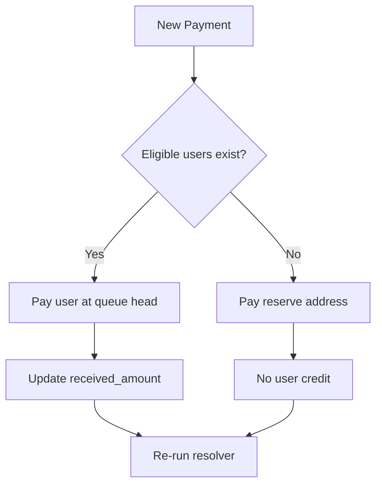

# Payout Target Resolver

> **Status**: SPEC
> 
> **Purpose**: Deterministic logic for selecting who receives next payment

---

## Core Principle

**Trenches never "generates" payout addresses.**  
It only selects from pre-existing addresses.

Two possible targets at any moment:
1. **User wallet addresses** (eligible entries in queue)
2. **Reserve wallet addresses** (predefined fallback)

---

## Priority Order



---

## Eligibility Check

```typescript
function isEligible(entry: TrenchEntry): boolean {
  return (
    entry.status === 'active' &&
    entry.round.status === 'active' &&
    entry.received_amount < entry.max_payout &&
    !entry.expired &&
    !entry.flagged
  )
}
```

---

## Target Selection

```typescript
function selectPayoutTarget(trench: Trench): PayoutTarget {
  // Priority 1: Eligible users
  const eligibleUsers = trench.queue
    .filter(isEligible)
    .sort(queueOrder) // belief → boost → joinedAt
  
  if (eligibleUsers.length > 0) {
    return { type: 'user', address: eligibleUsers[0].wallet }
  }
  
  // Priority 2: Reserve addresses
  return { type: 'reserve', address: getNextReserveAddress(trench) }
}
```

---

## Payment Amount Calculation

```typescript
function calculatePaymentAmount(entry: TrenchEntry): number {
  const remaining_cap = entry.max_payout - entry.received_amount
  return Math.min(entry.expected_payout_increment, remaining_cap)
}
```

---

## On-Chain Detection Flow

1. App displays: target address, exact amount, timer
2. User sends funds wallet → wallet
3. Watcher detects tx
4. System applies credit:
   - If user target → increment `received_amount`
   - If reserve target → no user credit
5. Re-run resolver

---

## Reserve Addresses

- Predefined wallets from project treasury
- Rotated round-robin
- **Never receive user credits**
- Keep flow alive without lying to users
